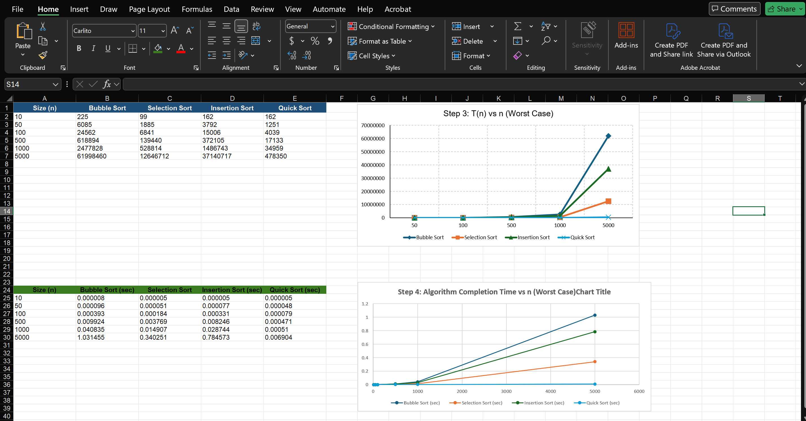

# Assignment 1

## Best Case:
This happens when the list is already sorted. The algorithm performs the minimum number of operations.

## Worst Case:
This happens when the list is in reverse order. The algorithm performs the maximum number of operations.

## Average Case:
This happens when the list is randomly arranged. The algorithm performs a normal amount of operations between best and worst case.

## Interpretation 
From the results, Insertion Sort performed very well in the best case because the list was already sorted. Bubble Sort had the highest number of steps in the worst case. Quick Sort had the lowest number of steps overall, showing better efficiency.

## Graph

## Interpretation of The Graph
The table data shows T(n) for worst case input. As the list size increased, Bubble Sort, Selection Sort, and Insertion Sort required significantly more operations. Bubble Sort increased the fastest, showing poor performance for larger lists. Quick Sort required much fewer operations and scaled much better as n increased. The results match the expected time complexities theories.

## Interpretation of Time Taken
The execution time results followed a similar pattern to Step 3. Bubble Sort took the longest time as the list size increased, while Quick Sort remained the fastest algorithm. This shows that the actual running time matches the expected algorithm performance.